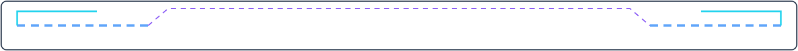
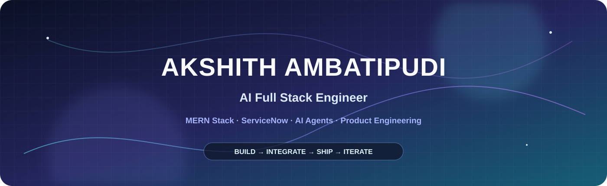
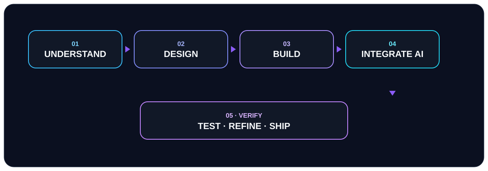

 

  

  

**MERN Stack** · **ServiceNow** · **AI Agents**

I build practical software where <strong>full-stack engineering</strong>, <strong>intelligent automation</strong>, and <strong>AI-powered experiences</strong> meet.
I like taking an idea from <strong>problem → architecture → implementation → usable product</strong>.

 

<a href="https://in.linkedin.com/in/akshith-ambatipudi-8ba361315">LinkedIn</a>
&nbsp;&nbsp;·&nbsp;&nbsp;
<a href="mailto:ambatipudi.akshith@gmail.com">Gmail</a>
&nbsp;&nbsp;·&nbsp;&nbsp;
<a href="https://github.com/Akshith826">GitHub</a>

  

---

## `01` · BUILDING NOW

<table>
<tr>
<td width="50%">

### ◇ AI Agents
Designing practical AI-driven workflows and intelligent application features instead of adding AI just for the sake of it.

</td>
<td width="50%">

### ◇ Full-Stack Products
Building across React, Node.js, APIs, databases, authentication and deployment with a product-first mindset.

</td>
</tr>
<tr>
<td>

### ◇ ServiceNow
Working with ServiceNow development, scripting, workflow automation and IT service solutions.

</td>
<td>

### ◇ Product Engineering
Turning ideas into complete experiences: clearer architecture, stronger UX, better documentation and usable software.

</td>
</tr>
</table>

---

## `02` · SELECTED WORK

<table>
<tr>
<td width="50%" valign="top">

### 🌌 SpaceVerse

**3D Solar System · WebXR · AI Space Traffic**

A full-stack educational platform combining interactive 3D exploration, VR, authentication, quizzes, reviews, community scenarios and AI-powered space traffic simulation.

**Core technologies**

`Node.js` `Express` `MongoDB` `Three.js`  
`WebXR` `React` `Python` `FastAPI` `scikit-learn`

**Explore:** [SpaceVerse](https://github.com/Akshith826/spaceverse)

</td>
<td width="50%" valign="top">

### ✦ Logomator

**AI Logo Generation · React · Supabase**

A web application where authenticated users provide brand details, choose a logo style, generate logos, manage their personal gallery and leave reviews.

**Core technologies**

`React` `TypeScript` `Vite`  
`Tailwind CSS` `Supabase` `React Router`

**Explore:** [Logomator](https://github.com/Akshith826/Logomatorapp)

</td>
</tr>
</table>

---

## `03` · WHAT I BRING TO A PRODUCT

<table>
<tr>
<td><b>AI integration</b> I use AI where it improves a workflow, decision, or user experience.</td>
<td><b>Full-stack execution</b> I can move from interface to API, data layer and application logic.</td>
</tr>
<tr>
<td><b>Product thinking</b> I start with the user problem and keep the technical solution focused.</td>
<td><b>Automation mindset</b> I look for repetitive work that software can execute consistently.</td>
</tr>
<tr>
<td><b>Engineering ownership</b> I care about how the pieces fit together, not only whether a single feature works.</td>
<td><b>Learning velocity</b> Projects are how I explore new tools, solve harder problems and improve.</td>
</tr>
</table>

---

## `04` · TOOLKIT

### Core Skills

### AI · Platform · Interactive

| Area | Tools I apply |
|---|---|
| **MERN Stack** | MongoDB · Express.js · React · Node.js · TypeScript · JavaScript |
| **ServiceNow** | ServiceNow development · JavaScript · workflows · platform automation |
| **AI / Agents** | Generative AI APIs · AI workflows · agentic patterns · intelligent product features |
| **Backend** | Node.js · Express.js · Python · FastAPI · REST APIs |
| **Data** | MongoDB · Supabase · Firebase · SQL concepts |
| **Interactive** | Three.js · WebXR |
| **Tooling** | Git · GitHub · Docker · Vite |

---

## `05` · GITHUB PULSE

### Contribution Activity

  

> The contribution snake is generated automatically from my real GitHub activity.

---

## `06` · REPOSITORY ANALYTICS

### Analytics included

`Repository activity` · `Language distribution` · `Commit habits` · `Yearly contribution calendar` · `Repository metadata`

The analytics graphic is generated automatically by GitHub Actions and stored in this repository, so the README does not depend on manually typed statistics.

---

## `07` · HOW I WORK

I start with the problem, make the architecture practical, build the experience end-to-end, and use AI only where it genuinely earns its place.

---

## `08` · DEVELOPMENT DIRECTION

**FOUNDATIONS**  
↓  
**FULL STACK**  
↓  
**SERVICENOW**  
↓  
**AI**  
↓  
**AI AGENTS**  
↓  
**PRODUCT ENGINEERING**

My goal is to become the kind of engineer who can take a product from **idea → system design → implementation → deployment → iteration**.

---

## `09` · OTHER BUILDS

| Repository | Direction |
|---|---|
| [LOC8R](https://github.com/Akshith826/LOC8R) | Location-focused application |
| [waveGPT](https://github.com/Akshith826/waveGPT) | AI experiment |
| [tt_week-4](https://github.com/Akshith826/tt_week-4) | Technical / development work |

I keep experiments visible, but I want the strongest work to get the clearest documentation and presentation.

---

 

### BUILD · LEARN · SHIP · REPEAT

<a href="https://in.linkedin.com/in/akshith-ambatipudi-8ba361315">LinkedIn</a>
&nbsp;&nbsp;·&nbsp;&nbsp;
<a href="mailto:ambatipudi.akshith@gmail.com">Gmail</a>
&nbsp;&nbsp;·&nbsp;&nbsp;
<a href="https://github.com/Akshith826">GitHub</a>

  

